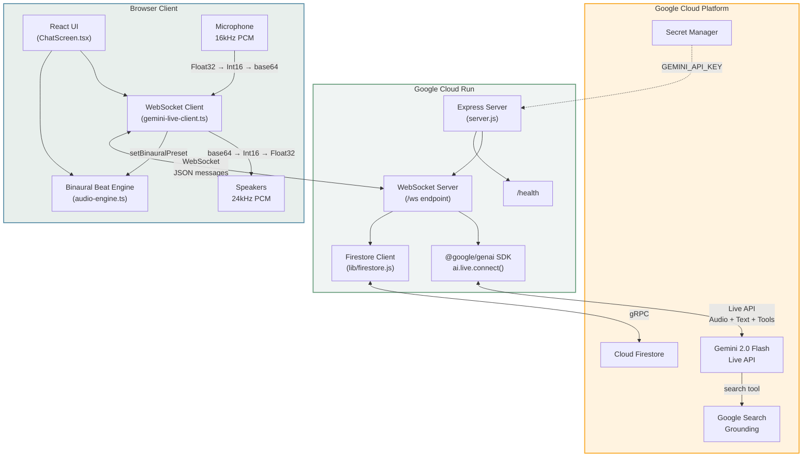
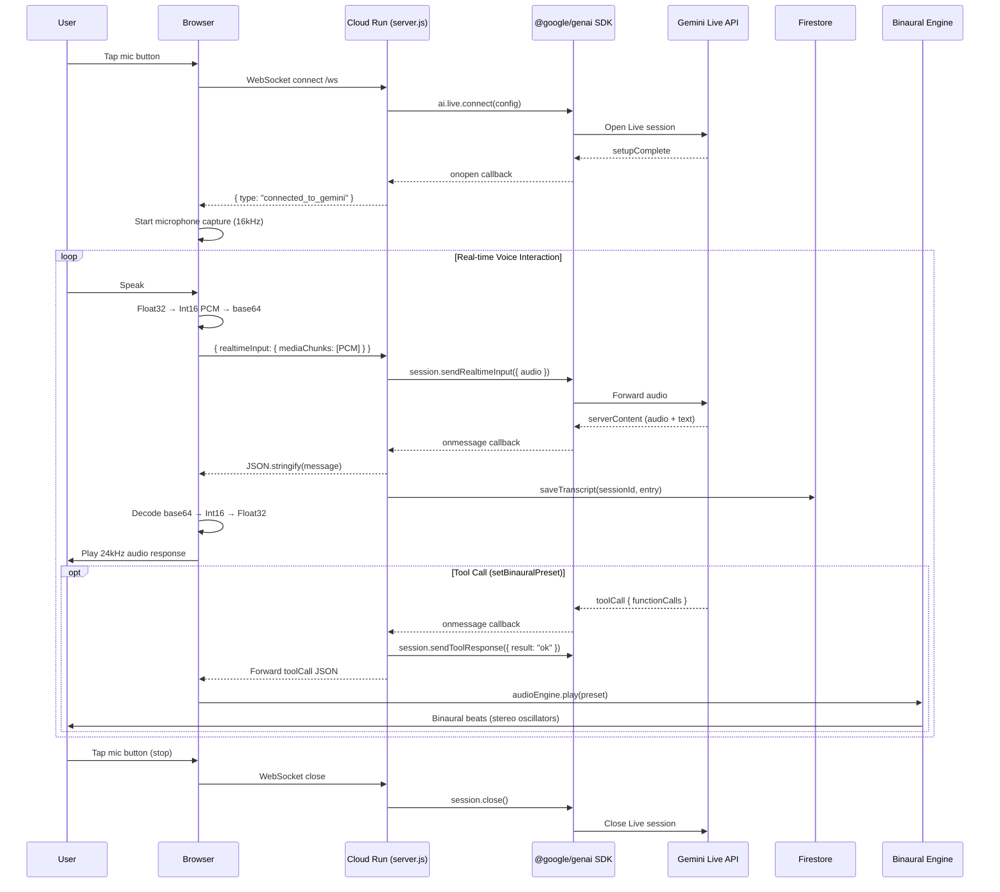
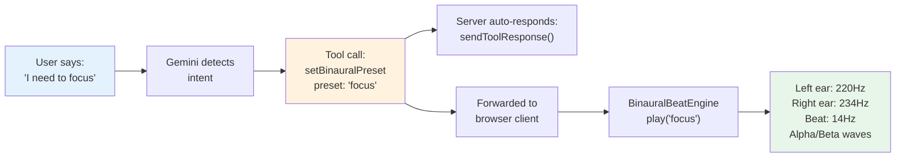
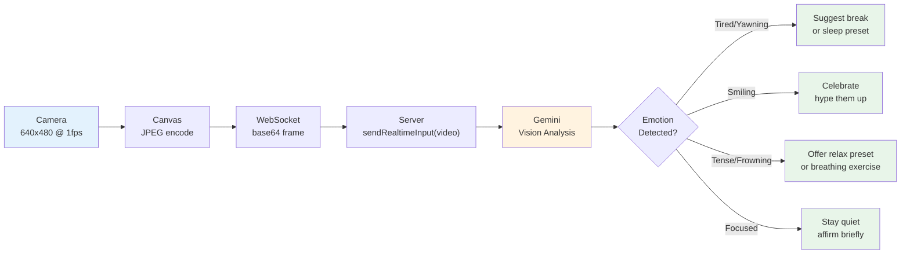
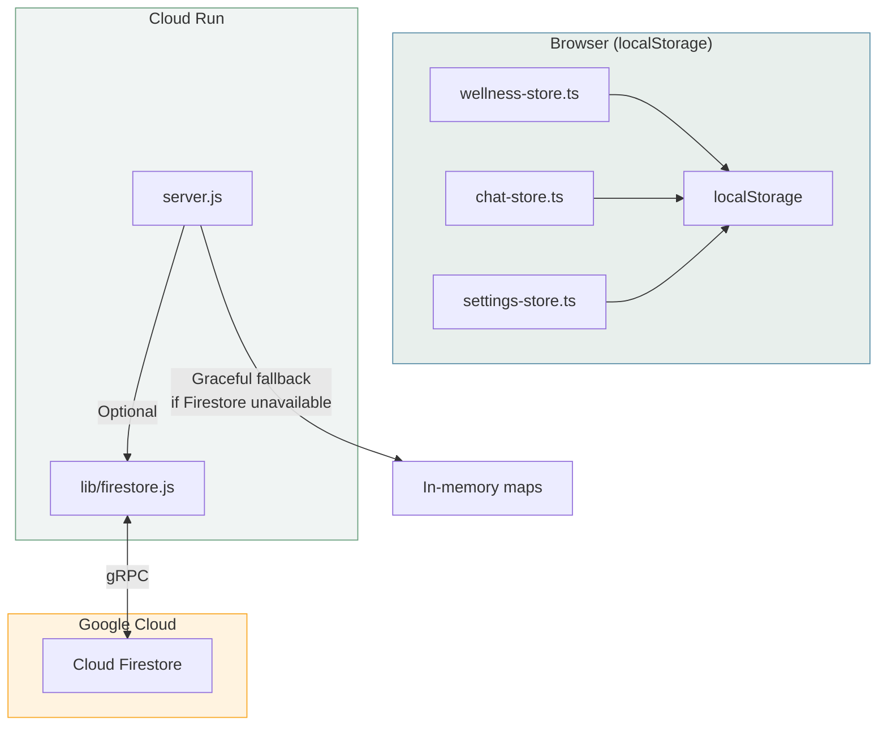
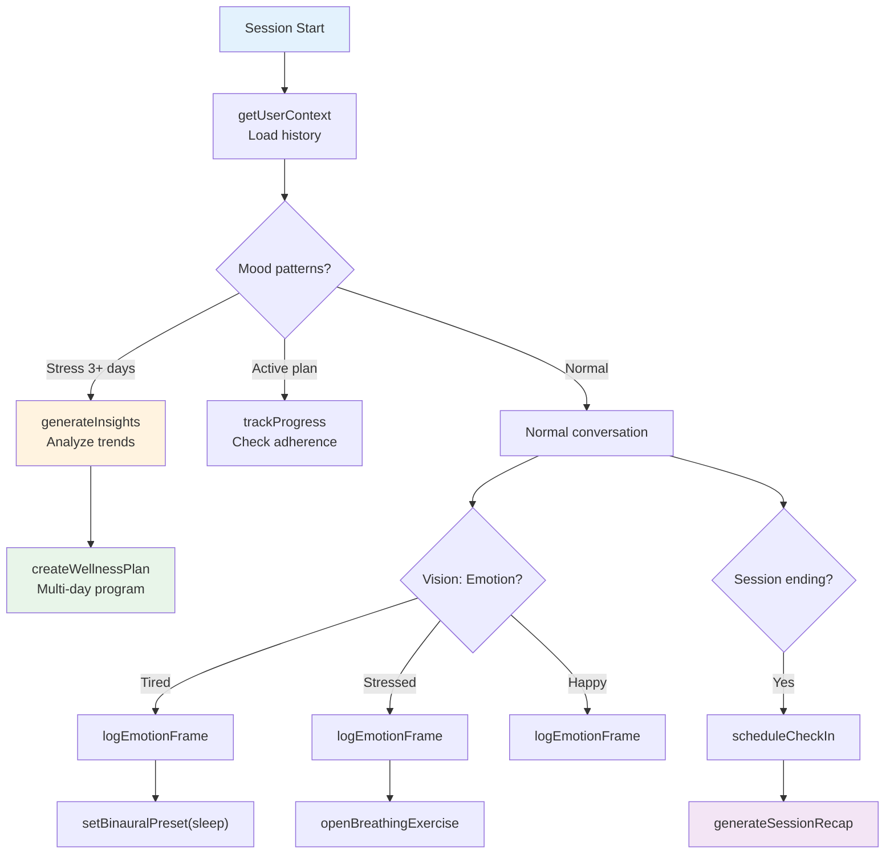

# Architecture — You The Best

## System Overview



---

## Voice Conversation Flow



---

## Tool Call Flow: Binaural Beats



---

## Emotion-Aware Vision Flow



---

## Audio Processing Pipeline

```mermaid
graph LR
    subgraph Input["Audio Input (Browser → Gemini)"]
        M["Microphone"] --> WAI["Web Audio API<br/>AudioContext 16kHz"]
        WAI --> SP["ScriptProcessor<br/>4096 samples"]
        SP --> F2I["Float32 → Int16"]
        F2I --> B64E["Base64 encode"]
        B64E --> WS1["WebSocket send"]
    end

    subgraph Server["Server (proxy)"]
        WS1 --> SRI["session.sendRealtimeInput()"]
        SRI --> GEM["Gemini Live API"]
        GEM --> FWD["onmessage → forward"]
    end

    subgraph Output["Audio Output (Gemini → Browser)"]
        FWD --> WS2["WebSocket receive"]
        WS2 --> B64D["Base64 decode"]
        B64D --> I2F["Int16 → Float32"]
        I2F --> BUF["AudioBuffer<br/>24kHz"]
        BUF --> Q["Play queue"]
        Q --> SPKR["Speakers"]
    end

    style Input fill:#e3f2fd,stroke:#1565c0
    style Server fill:#f3e5f5,stroke:#7b1fa2
    style Output fill:#e8f5e9,stroke:#2e7d32
```



---

## Binaural Beat Synthesis

| Preset | Base Frequency | Beat Frequency | Brainwave Band | Effect |
|--------|---------------|----------------|----------------|--------|
| Focus | 220 Hz | 14 Hz | Alpha/Beta | Alert concentration |
| Relax | 180 Hz | 6 Hz | Theta | Meditation, calm |
| Sleep | 150 Hz | 3 Hz | Delta | Deep sleep |

**How it works:** Two sine waves are panned hard-left and hard-right. The left ear hears the base frequency, the right ear hears base + beat difference. The brain perceives a phantom "beat" at the difference frequency, entraining brainwave activity to the target band.

```
Left ear:  ───── 220 Hz sine ─────
Right ear: ───── 234 Hz sine ─────
Brain:     ───── 14 Hz beat  ───── (Alpha/Beta)
```

---

## Ambient Soundscapes

Procedurally generated ambient sounds using noise synthesis:

| Sound | Technique | Filter | Effect |
|-------|-----------|--------|--------|
| Rain | Brown noise + random droplet spikes | Lowpass 3kHz | Steady rain with occasional drops |
| Ocean | Pink noise × sine LFO (0.06Hz) | Lowpass 800Hz, LFO-modulated | Rhythmic wave swells |
| Forest | White noise floor + random sine chirps | Lowpass 6kHz | Quiet forest with bird calls |

---

## Offline-First Data Architecture

YTB uses a **dual-persistence** strategy to ensure the app works with or without Cloud Firestore:



**How it works:**

1. **Client-side (always available):** `wellness-store.ts` persists all mood entries, wellness plans, emotion timelines, check-ins, and session recaps to `localStorage`. This is the primary data source for the UI.

2. **Server-side (optional):** `lib/firestore.js` mirrors data to Firestore when credentials are available. The server uses `try/catch` to load the module and falls back gracefully:
   - Rate limiting falls back to an in-memory `Map`
   - Agentic tools return offline-mode responses with empty data
   - All API endpoints return sensible defaults (empty arrays, null plans)

3. **No data loss:** Since the client stores all user data locally, the app is fully functional without Firestore. Firestore adds cross-device sync and server-side analytics but is not required.

**When Firestore is unavailable:**
- Rate limiting: In-memory per-IP sliding window (resets on server restart)
- Agentic tools (`getUserContext`, `getMoodHistory`, etc.): Return `{ message: "Running in offline mode" }` with empty data
- Conversation persistence: Relies on `localStorage` only
- Session recaps: Generated and stored client-side

---

## Agentic Tool Chain

YTB's 14 Gemini function tools form a proactive wellness loop:



**Session lifecycle:**
1. **Start:** `getUserContext` → `generateInsights` → `createWellnessPlan` (if needed)
2. **During:** `logMood`, `logEmotionFrame`, `setBinauralPreset`, `setAmbientSound`, `openBreathingExercise`, `getWellnessTip`, `saveJournalEntry`
3. **End:** `scheduleCheckIn` → `generateSessionRecap`

---

## Test Coverage

| Test File | Tests | Coverage Area |
|-----------|-------|---------------|
| `app/lib/audio-engine.test.ts` | 15 | Binaural beats + ambient sound engines |
| `app/lib/chat-service.test.ts` | 4 | Greeting generation, API fallback |
| `app/lib/wellness-store.test.ts` | 23 | Mood entries, plans, check-ins, recaps, heatmap |
| `server.test.js` | 34 | Crisis detection, rate limiting, schedule parsing, tool declarations |
| **Total** | **76** | |
