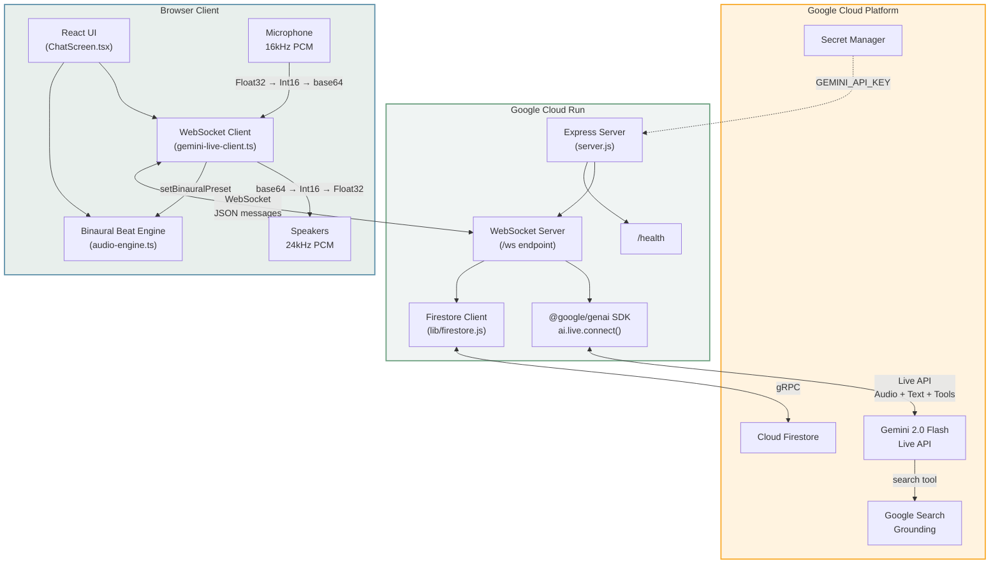

# YTB — AI-Powered Personal Hypeman

> Your real-time AI voice companion that hypes you up, helps you relax, and supports your wellness through binaural beats and guided breathing exercises.

Built for the **Gemini Live Agent Challenge** hackathon.

---

## 📋 Hackathon Submission Checklist

| Requirement | Status |
|-------------|--------|
| Gemini Live API or ADK | ✅ Gemini 2.0 Flash Live via `@google/genai` SDK |
| Google Cloud hosting | ✅ Cloud Run |
| At least one GCP service | ✅ Cloud Run, Firestore, Secret Manager |
| Public code repository | ✅ (link in Devpost submission) |
| Spin-up instructions | ✅ See [Setup](#setup) below |
| Proof of GCP deployment | ✅ See table below |
| Architecture diagram | ✅ [ARCHITECTURE.md](ARCHITECTURE.md) (Mermaid renders on GitHub) |
| Demo video | ✅ Submitted on Devpost |
| English language | ✅ |
| Judges: Evaluation guide | See [JUDGING.md](JUDGING.md) |

---

## 🏆 Bonus Points Addressed

- **Blog Post**: Read about the development journey in [BLOG_POST.md](BLOG_POST.md).
- **Automated Deployment**: The app uses Cloud Build CI/CD (`cloudbuild.yaml`) and includes a **Terraform** configuration (`terraform/`) for Infrastructure as Code.
- **GDG Member**: The creator is an active member of the Google Developer Groups (GDG) community.

---

## Proof of Google Cloud Deployment

This project's backend runs on **Google Cloud**. Judges can verify GCP usage via these code files:

| Evidence | File | What it demonstrates |
|----------|------|----------------------|
| Cloud Run + WebSocket | [server.js](server.js) | Express server running on Cloud Run (PORT 8080), WebSocket proxy to Gemini Live API |
| Firestore | [lib/firestore.js](lib/firestore.js) | Cloud Firestore for conversations, profiles, rate limiting via `firebase-admin` |
| Secret Manager | [server.js](server.js) L17 | `GEMINI_API_KEY` from env (injected by Cloud Run from Secret Manager) |
| Deployment | [deploy.sh](deploy.sh), [cloudbuild.yaml](cloudbuild.yaml) | `gcloud run deploy`, Cloud Build pipeline |
| IaC | [terraform/](terraform/) | Terraform for Cloud Run service, Secret Manager, IAM |

**Live health check**: [https://ashanti-6exqtj2u2q-uc.a.run.app/health](https://ashanti-6exqtj2u2q-uc.a.run.app/health)

---

## What It Does

**"I need a pep talk!"**
YTB is a real-time AI wellness companion powered by Google's Gemini 2.0 Flash Live API. Talk to it like a friend — it listens, responds with voice, and adapts the environment around you.

- **Real-time voice + vision conversation** — speak naturally and optionally share your camera; Gemini actively reads your facial expressions and body language to personalize its responses
- **Emotion-aware AI** — the agent proactively detects if you look tired, stressed, happy, or tense and responds empathetically without being asked (e.g., suggesting relaxation if you're frowning)
- **AI-triggered binaural beats** — Gemini detects your mood and activates focus (14Hz Alpha/Beta), relax (6Hz Theta), or sleep (3Hz Delta) brainwave entrainment via function calling
- **14 agentic tools + Google Search grounding** — setBinauralPreset, setAmbientSound, logMood, saveJournalEntry, getWellnessTip, openBreathingExercise, getUserContext, getMoodHistory, createWellnessPlan, trackProgress, generateInsights, logEmotionFrame, scheduleCheckIn, generateSessionRecap — plus real-time Google Search for current wellness research and factual grounding
- **Guided breathing exercises** — box breathing, 4-7-8 technique, and meditation protocols with animated visual progress rings, launchable by the AI via tool calling
- **Session memory** — conversation context is injected into each live session so Gemini remembers what you've been discussing
- **Gemini-powered text chat** — text messages are routed to Gemini (not hardcoded responses), with adaptive personality across three hype levels and rate limiting for security
- **Persistent conversations** — transcripts, mood logs, and journal entries stored in Google Cloud Firestore

---

## Architecture



See [ARCHITECTURE.md](ARCHITECTURE.md) for the full sequence diagram and tool call flow.

---

## Tech Stack

| Layer | Technology |
|-------|------------|
| Frontend | Next.js 16, React 19, TypeScript |
| AI | Gemini 2.0 Flash Live API via `@google/genai` SDK |
| Audio | Web Audio API (ScriptProcessorNode, binaural beat synthesis) |
| Backend | Express 5 + custom WebSocket proxy (Node.js 20) |
| Database | Google Cloud Firestore |
| Hosting | Google Cloud Run (Docker) |
| Secrets | Google Cloud Secret Manager |
| Styling | Custom CSS design system with CSS variables (no framework) |

---

## How It Works

1. **Browser** captures microphone audio at 16kHz mono PCM and optionally camera frames at 640x480 JPEG (1 frame/sec for near-real-time vision)
2. Audio/video is encoded and sent via WebSocket to the Express server
3. **Server** injects recent conversation history as context, then forwards audio/video to Gemini Live API using the `@google/genai` SDK
4. **Gemini** analyzes audio, video, and conversation context — it actively reads facial expressions and body language to detect emotions. It responds with audio (24kHz PCM) and may invoke any of 5 tools + Google Search: binaural beats, mood logging, journal saving, wellness tips, breathing exercises, or web search for real-time information
5. **Server** auto-responds to tool calls (with real data — e.g., random wellness tips, Firestore saves) so Gemini can continue speaking
6. **Server** saves conversation transcripts, mood logs, and journal entries to **Firestore**
7. **Browser** decodes audio, activates binaural beats, opens breathing exercises, or processes other tool actions
8. When the user interrupts mid-response, Gemini signals interruption and the browser immediately stops audio playback

---

## Features

- [x] Real-time bidirectional audio streaming with Gemini Live API
- [x] Vision input — 640x480 camera frames at 1fps for near-real-time visual context
- [x] Active emotion detection — Gemini reads facial expressions, body language, and energy cues to respond proactively
- [x] 14 Gemini function tools (setBinauralPreset, setAmbientSound, logMood, saveJournalEntry, getWellnessTip, openBreathingExercise, getUserContext, getMoodHistory, createWellnessPlan, trackProgress, generateInsights, logEmotionFrame, scheduleCheckIn, generateSessionRecap)
- [x] Google Search grounding — real-time web search for current wellness research and factual information
- [x] Binaural beat synthesis (focus 14Hz / relax 6Hz / sleep 3Hz)
- [x] Guided breathing exercises with SVG ring animation (AI-launchable)
- [x] Conversation context injection — Gemini receives recent chat history at session start
- [x] Text chat powered by Gemini API (not hardcoded responses)
- [x] Natural interruption handling — audio stops immediately when you speak
- [x] Mood logging and journal entries persisted to Firestore
- [x] Wellness quick-actions strip (breathe, meditate, ground, cool down)
- [x] Customizable hype level (chill / normal / maximum)
- [x] Dark / light / system theme support
- [x] Conversation persistence via Firestore
- [x] Cloud Run deployment with WebSocket support
- [x] Rate limiting on API endpoints (20 req/min per IP)
- [x] Health check endpoint for container orchestration
- [x] Graceful shutdown handling (SIGTERM)
- [x] WebSocket auto-reconnection with exponential backoff (up to 5 retries)
- [x] Structured JSON logging via Pino (GCP Cloud Logging compatible)
- [x] Error boundaries (error.tsx, global-error.tsx) for graceful UI crash recovery
- [x] Automated test suite (Vitest + React Testing Library)

---

## Setup

### Prerequisites

- **Node.js 20+**
- **Google Cloud project** with the Generative Language API enabled
- A **Gemini API key** from [Google AI Studio](https://aistudio.google.com/)
- (Optional) Firestore database for conversation persistence

### Environment Variables

Create a `.env` file in the project root:

```env
GEMINI_API_KEY=your-gemini-api-key

# For local Firestore access (optional):
GOOGLE_APPLICATION_CREDENTIALS=path/to/service-account.json
```

### Local Development

```bash
# Install dependencies
npm install

# Run tests
npm test

# Start the development server
npm run dev

# Open http://localhost:3000
```

### Testing

The project includes an automated test suite built with **Vitest** and **React Testing Library**:

```bash
npm test
```

Tests cover:
- `chat-service.ts` — Greeting generation, hype level personalization, API fallback behavior
- `audio-engine.ts` — Binaural preset routing, play/stop lifecycle, duplicate preset handling

### Cloud Deployment (Google Cloud Run)

```bash
# 1. Set your GCP project ID
export GCP_PROJECT_ID=your-project-id

# 2. Enable required APIs
gcloud services enable \
  run.googleapis.com \
  cloudbuild.googleapis.com \
  firestore.googleapis.com \
  secretmanager.googleapis.com

# 3. Create Firestore database (if not already created)
gcloud firestore databases create --location=us-central1

# 4. Store your Gemini API key in Secret Manager
echo -n "your-gemini-api-key" | gcloud secrets create GEMINI_API_KEY --data-file=-

# 5. Deploy
chmod +x deploy.sh
./deploy.sh
```

The deploy script builds the Docker image via Cloud Build, deploys to Cloud Run with WebSocket support (60-minute timeout, session affinity), and attaches the API key from Secret Manager.

---

## Project Structure

```
ashanti/
├── server.js                    # Express + WebSocket proxy + @google/genai SDK
├── vitest.config.ts             # Test runner configuration
├── lib/
│   ├── firestore.js             # Firestore service (server-side, conversations + profiles)
│   └── logger.js                # Structured JSON logger (Pino, GCP-compatible)
├── app/
│   ├── page.tsx                 # Home page
│   ├── layout.tsx               # Root layout with metadata
│   ├── error.tsx                # Error boundary for graceful crash recovery
│   ├── global-error.tsx         # Root error boundary (catches layout-level errors)
│   ├── globals.css              # Design system (1300+ lines of CSS variables)
│   ├── components/
│   │   ├── ChatScreen.tsx       # Main chat UI + live session management
│   │   ├── VoiceButton.tsx      # Microphone toggle button
│   │   ├── WellnessSheet.tsx    # Bottom sheet for breathing exercises
│   │   ├── BinauralControls.tsx # Soundscape preset controls
│   │   ├── WellnessStrip.tsx    # Quick wellness action pills
│   │   ├── BrandLogo.tsx        # Sparkles + Heart composite icon
│   │   └── SegmentedControl.tsx # Reusable segmented picker
│   ├── lib/
│   │   ├── gemini-live-client.ts   # Browser WebSocket + audio pipeline (auto-reconnect)
│   │   ├── audio-engine.ts         # Binaural beat synthesis engine
│   │   ├── audio-engine.test.ts    # Unit tests for audio engine
│   │   ├── chat-service.ts         # Gemini text chat + fallback responses
│   │   ├── chat-service.test.ts    # Unit tests for chat service
│   │   ├── chat-store.ts           # localStorage persistence
│   │   └── settings-store.ts       # User settings persistence
│   └── settings/
│       └── page.tsx             # Settings page (name, hype level, theme)
├── Dockerfile                   # Multi-stage Docker build for Cloud Run
├── cloudbuild.yaml              # Cloud Build CI/CD pipeline
├── deploy.sh                    # One-command deployment script
├── terraform/                   # Infrastructure as Code (Cloud Run, IAM, etc.)
├── ARCHITECTURE.md              # Detailed architecture diagrams
└── .gcloudignore                # Files excluded from Cloud Build
```

---

## Google Cloud Services Used

| Service | Purpose |
|---------|---------|
| **Cloud Run** | Hosts the containerized Next.js + Express + WebSocket application |
| **Gemini 2.0 Flash (Live API)** | Real-time voice AI agent via `@google/genai` SDK |
| **Google Search (Grounding)** | Real-time web search tool for current wellness information and factual grounding |
| **Cloud Firestore** | Persistent storage for conversation transcripts and user profiles |
| **Secret Manager** | Secure storage for the `GEMINI_API_KEY` |
| **Container Registry** | Docker image storage for Cloud Run deployments |
| **Cloud Build** | CI/CD pipeline for automated builds and deployments |

---

## License

MIT
